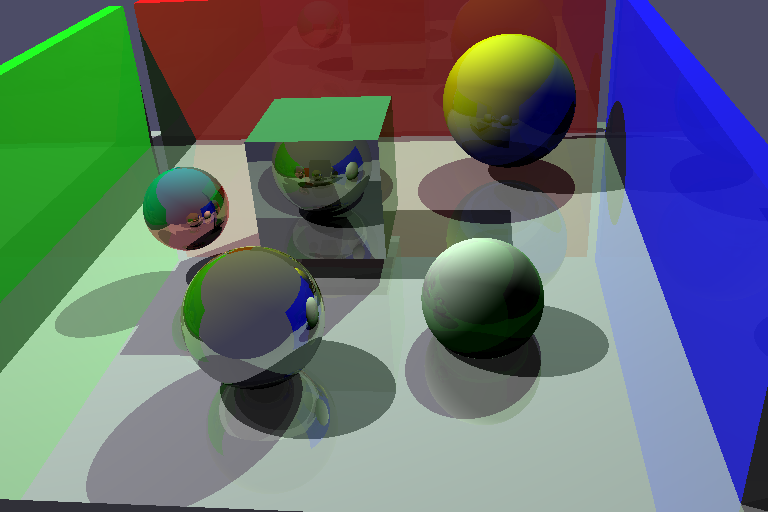
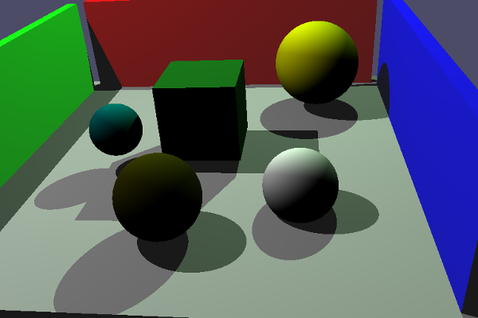
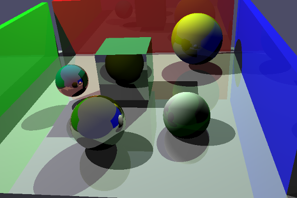
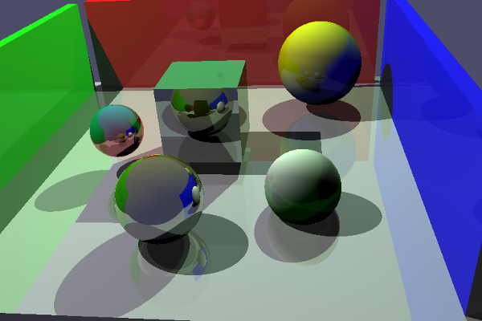

# RayTracing

todo desc

## TODO

shadow
reflection (with example depth 0 1 2)

## Usage

* Compilation :
- `mkdir build`
- `cd build`
- `cmake ../`
- `make`

* Run : `./bin/raytracer width height depth`
	- *width* : width of the image
	- *height* : height of the image
	- *depth* : maximum number of ray reflections

* Delete binary : `make clean`
